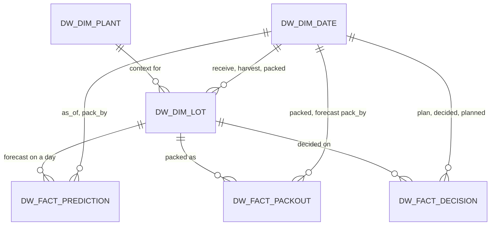

# Entity-relationship diagram

Conceptual and logical model of the Citrus Inventory database, in crow's foot
notation. Twenty-two operational entities plus Django's `User`; the six
reporting tables of the star schema in `warehouse/models.py` are described
at the end. Read each
relationship line from the entity nearest it: the inner mark is the minimum,
the outer mark the maximum.

```mermaid
erDiagram
    PLANT ||--o{ ROOM : "has"
    PLANT ||--o{ LOT : "receives"
    PLANT ||--o{ PLANT_REPORT_RECIPIENT : "emails report to"
    PLANT |o--o{ USER_PROFILE : "pins"
    PLANT ||--o{ BOARD_CALIBRATION : "calibrates station at"
    PLANT ||--o{ PACK_PLAN : "publishes"
    PLANT ||--o{ REPORT_DELIVERY : "sends"
    PLANT |o--o{ IMPORT_BATCH : "scopes"
    GROWER ||--o{ LOT : "supplies"
    ROOM |o--o{ LOT : "currently holds"
    ROOM ||--o{ ROOM_CONDITION : "logs"
    LOT ||--o{ LOT_ROOM_MOVE : "moves"
    ROOM ||--o{ LOT_ROOM_MOVE : "receives"
    LOT ||--o{ LOT_TREATMENT : "is treated"
    LOT ||--o{ PACKOUT : "packs out as"
    LOT ||--o{ SAMPLE : "is sampled"
    SAMPLE ||--o{ SAMPLE_PHOTO : "photographed as"
    LOT ||--o{ PREDICTION : "is forecast"
    PACK_PLAN ||--|{ PLAN_RECOMMENDATION : "lists"
    LOT ||--o{ PLAN_RECOMMENDATION : "is ranked in"
    PREDICTION |o--o{ PLAN_RECOMMENDATION : "frozen into"
    PLAN_RECOMMENDATION ||--o{ PLAN_DECISION : "decided by"
    USER ||--o| USER_PROFILE : "has"
    USER |o--o{ SAMPLE : "takes or voids"
    USER |o--o{ LOT_ROOM_MOVE : "records"
    USER |o--o{ IMPORT_BATCH : "uploads"
    USER |o--o{ PACK_PLAN : "publishes or locks"
    USER |o--o{ PLAN_DECISION : "decides"
    IMPORT_BATCH |o--o{ PACKOUT : "sourced"
    IMPORT_BATCH |o--o{ ROOM_CONDITION : "sourced"
    IMPORT_BATCH |o--o{ LOT_TREATMENT : "sourced"
    LOT ||--o{ LOT_CHANGE : "edited as"
    USER |o--o{ LOT_CHANGE : "made"
    SAMPLE_PHOTO ||--o{ FRUIT_MEASUREMENT : "measures"

    PLANT {
        bigint id PK
        varchar code UK "SLA1, SLA3, SLA4"
        varchar name
        varchar city
        numeric weekly_pack_capacity_bins
    }
    PLANT_REPORT_RECIPIENT {
        bigint id PK
        bigint plant_id FK
        varchar email "unique per plant"
    }
    ROOM {
        bigint id PK
        bigint plant_id FK
        varchar name "unique per plant"
        varchar room_type "storage or degreening"
        numeric target_temp_f
    }
    GROWER {
        bigint id PK
        varchar sunkist_grower_no UK
        varchar name
    }
    LOT {
        bigint id PK
        bigint plant_id FK
        bigint grower_id FK
        bigint current_room_id FK "nullable, derived from latest move"
        varchar lot_no "unique per plant"
        varchar variety
        date harvest_date "CHECK not after receive_date"
        date receive_date
        char receiving_color "DG LG S Y"
        float intake_cci_mean
        int bins_received
        varchar status "in_storage packed dumped"
        date packed_date "CHECK present iff packed"
    }
    LOT_ROOM_MOVE {
        bigint id PK
        bigint lot_id FK
        bigint room_id FK
        bigint moved_by_id FK
        date moved_on
        timestamptz occurred_at "nullable"
    }
    LOT_TREATMENT {
        bigint id PK
        bigint lot_id FK
        bigint source_batch_id FK
        timestamptz applied_at
        varchar treatment_type
        numeric concentration
        numeric duration_hours
    }
    ROOM_CONDITION {
        bigint id PK
        bigint room_id FK
        bigint source_batch_id FK
        timestamptz recorded_at
        numeric temperature_f
        numeric relative_humidity_pct
        numeric ethylene_ppm
        varchar source "unique with room and recorded_at"
    }
    PACKOUT {
        bigint id PK
        bigint lot_id FK
        bigint source_batch_id FK
        date packed_date "unique per lot"
        int cartons_fancy
        int cartons_choice
        int cartons_standard
        int cartons_products
        int cartons_total "GENERATED"
        numeric fresh_pct "GENERATED"
        numeric bins_packed
        bool is_final
        char packout_color
        numeric decay_pct
        bool meets_spec
    }
    SAMPLE {
        bigint id PK
        bigint lot_id FK
        bigint sampled_by_id FK
        bigint voided_by_id FK
        timestamptz sampled_at
        char foreman_color
        int foreman_pack_within_weeks
        int fruit_count
        int decay_count "CHECK at most fruit_count"
        int soft_count "CHECK at most fruit_count"
        int shrivel_count "CHECK at most fruit_count"
        int chilling_injury_count "CHECK at most fruit_count"
        int rind_breakdown_count "CHECK at most fruit_count"
        varchar purpose "routine or holdout, subtype discriminator"
        varchar marketability "holdout only"
        varchar failure_reason "holdout only"
        bool is_void
    }
    SAMPLE_PHOTO {
        bigint id PK
        bigint sample_id FK
        varchar image
        varchar status "pending processing scored failed"
        int fruit_detected
        float mean_cci
        float std_cci
        json per_fruit_cci "repeating group, see notes"
        json calibration_snapshot
        json scoring_metadata
        bool quality_ok
    }
    FRUIT_MEASUREMENT {
        bigint id PK
        bigint photo_id FK "unique with index"
        int index
        float lab_l
        float lab_a
        float lab_b
        float cci "nullable"
    }
    LOT_CHANGE {
        bigint id PK
        bigint lot_id FK
        bigint changed_by_id FK "nullable"
        timestamptz changed_at
        varchar source "web path, import kind, packout, command"
        varchar field
        text old_value
        text new_value
    }
    BOARD_CALIBRATION {
        bigint id PK
        bigint plant_id FK
        varchar board_id
        varchar phone_id
        timestamptz measured_at
        json reference_rgb "nine patches"
        bool active
    }
    PREDICTION {
        bigint id PK
        bigint lot_id FK
        date as_of_date "unique per lot"
        float cci_now
        char stage
        float drift_per_day
        date predicted_yellow_date
        date pack_by_date
        float decay_rate
        varchar confidence
        varchar model_version
        json inputs "audit snapshot"
    }
    PACK_PLAN {
        bigint id PK
        bigint plant_id FK
        bigint published_by_id FK
        bigint locked_by_id FK
        date plan_date
        int version "unique per plant"
        varchar source
        varchar market_regime "editable after publish"
        timestamptz locked_at
        json settings_snapshot
    }
    PLAN_RECOMMENDATION {
        bigint id PK
        bigint plan_id FK "unique with lot"
        bigint lot_id FK
        bigint prediction_id FK
        int rank
        varchar action
        bool requires_decision
        date pack_by_date "snapshot"
        char stage "snapshot"
        float cci_now "snapshot"
        numeric bins_remaining "snapshot"
        varchar room_name "snapshot"
    }
    PLAN_DECISION {
        bigint id PK
        bigint recommendation_id FK
        bigint decided_by_id FK
        varchar status "accepted deferred overridden"
        varchar reason
        date planned_pack_date
        timestamptz decided_at
        bool after_lock
        varchar market_regime "snapshot of plan at decision time"
    }
    REPORT_DELIVERY {
        bigint id PK
        bigint plant_id FK
        date report_date "unique per plant"
        varchar status
        json recipients "addresses the report went to"
        int attempts
    }
    IMPORT_BATCH {
        bigint id PK
        bigint uploaded_by_id FK
        bigint plant_scope_id FK
        varchar kind
        varchar file
        timestamptz uploaded_at
        int rows_ok
        int rows_failed
        json error_report
    }
    USER_PROFILE {
        bigint id PK
        int user_id FK "one to one"
        bigint plant_id FK "nullable means all plants"
    }
    USER {
        int id PK
        varchar username UK
        bool is_active "deactivate, never delete"
    }
    MODEL_SETTINGS {
        bigint id PK "singleton, always 1"
        float cci_dg_max
        float cci_lg_max
        float cci_s_max
        float prior_drift_dg
        float prior_drift_lg
        float prior_drift_s
        float prior_drift_y
        int buffer_days
        int sample_fruit_count
    }
```

## Relationship types

| Pattern | Instances | How it is implemented |
|---|---|---|
| One-to-many | Plant to Room, Plant to Lot, Grower to Lot, Lot to Sample, Sample to SamplePhoto, Lot to Prediction, Lot to Packout, Lot to LotTreatment, Room to RoomCondition, PackPlan to PlanRecommendation, PlanRecommendation to PlanDecision, Plant to PlantReportRecipient | Foreign key on the many side |
| Many-to-many with attributes | Lot and Room through **LotRoomMove** (date, timestamp, who); PackPlan and Lot through **PlanRecommendation** (rank, action, frozen numbers) | Associative entity with a surrogate key plus a unique constraint on the natural pair: (plan, lot) for a recommendation, (lot, room, date or timestamp) for a move |
| One-to-one | User and UserProfile | Foreign key with a UNIQUE constraint on the profile side, kept separate so the built-in auth table is untouched |
| Multi-valued attribute | A plant's report recipients; the fruit in a photo | Own tables: PlantReportRecipient unique on (plant, email); FruitMeasurement unique on (photo, index), mirrored from the pipeline's JSON arrays each time a photo is scored |
| Change history | Edits to a lot | LotChange, append-only, one row per changed field with user and source |
| Supertype and subtype | Sample: routine versus shelf-life holdout | Single table with a `purpose` discriminator; holdout-only attributes are nullable and required when `purpose` is holdout |
| Unary | none | |

## Participation

- A Lot must belong to a Plant and a Grower (total). A Lot may have zero samples, moves, packouts or predictions (partial).
- A PackPlan must contain at least one recommendation to be published. This is enforced by `publish_plan`, not the schema.
- A Room may currently hold zero or many lots. A lot may be in no room when its location is unknown.
- A User may take zero or many samples. A sample may have no recorded taker when it came from an import.

## Delete rules

| Rule | Where | Why |
|---|---|---|
| PROTECT | Every reference to Lot, Plant, Grower, User, and Room from a move | History is never destroyed by deleting its subject. Users are deactivated. Lots change status. |
| CASCADE | Room to Plant, RoomCondition to Room, UserProfile to User, PlantReportRecipient to Plant, SamplePhoto to Sample, PlanRecommendation to PackPlan, PlanDecision to PlanRecommendation | Weak entities that mean nothing without their parent |
| SET NULL | Lot.current_room, source_batch on packouts, conditions and treatments, PlanRecommendation.prediction | Genuinely optional provenance; the fact survives without it |

At the database level, `scripts/db_roles.sql` additionally revokes DELETE on the lot and history tables from the application role, so "never delete" is a rule the RDBMS enforces and not only the ORM.

## Normal form notes

The schema is in third normal form with these deliberate exceptions. Each is a snapshot rather than a transitive dependency:

- **PlanRecommendation** copies stage, CCI, confidence, bins remaining, room name and days in storage from the Prediction and Lot at publish time, so a decision can be judged against exactly what the system said.
- **PlanDecision.market_regime** copies the plan's regime at decision time because the GM may change the plan's regime after publish.
- **Lot.current_room**, **Lot.status** and **Lot.packed_date** are derived from the latest room move and the final packout. The importers and `Packout.save` maintain them, and two CHECK constraints keep status and packed_date consistent with each other.
- **Packout.cartons_total** and **Packout.fresh_pct** are STORED generated columns. The database derives them, so they cannot drift.

Repeating groups kept wide by design, for capture speed, and left as documented trade-offs: five defect counts on Sample, four carton grades on Packout, and per-color priors on ModelSettings. The per-fruit arrays on SamplePhoto remain as the pipeline's raw record but are now also normalized into FruitMeasurement rows.

## Reporting star schema

The operational schema above is normalized for transactions. `warehouse/models.py` holds a separate, deliberately denormalized star schema for analysis, rebuilt in full by `manage.py build_warehouse`:

Facts are events with measures: a nightly prediction, a packout run (with its lateness against the forecast that existed at the time), a management decision. Dimensions are what you slice by: plant, lot with grower and variety flattened in, and a calendar with year, month, ISO week and weekday. Date keys are integers in yyyymmdd form.
